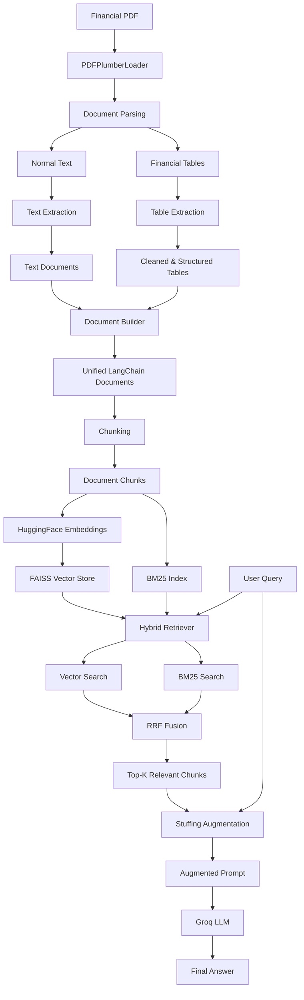

# PDFPlumber Table Extraction RAG

A practical exploration of **PDFPlumber for financial PDF parsing, table extraction, table structuring, and Retrieval-Augmented Generation (RAG)**.

The primary focus of this project is understanding how financial tables can be extracted from PDFs, cleaned, normalized, transformed into structured representations, and incorporated into a RAG pipeline alongside normal textual content.

## Table of Contents

- [Project Overview](#project-overview)
- [Why This Project](#why-this-project)
- [Problem Statement](#problem-statement)
- [Why Financial PDFs Are Challenging](#why-financial-pdfs-are-challenging)
- [Key Concepts Covered](#key-concepts-covered)
- [Architecture](#architecture)
- [End-to-End Pipeline](#end-to-end-pipeline)
- [PDF Loading](#pdf-loading)
- [Text Extraction](#text-extraction)
- [Financial Table Extraction](#financial-table-extraction)
- [Table Cleaning](#table-cleaning)
- [Table Normalization](#table-normalization)
- [Table Structuring](#table-structuring)
- [Document Building](#document-building)
- [Chunking](#chunking)
- [Embeddings](#embeddings)
- [FAISS Vector Store](#faiss-vector-store)
- [Hybrid Retrieval](#hybrid-retrieval)
- [BM25 Retrieval](#bm25-retrieval)
- [Reciprocal Rank Fusion](#reciprocal-rank-fusion)
- [Context Augmentation](#context-augmentation)
- [Groq Generation](#groq-generation)
- [Project Structure](#project-structure)
- [Installation](#installation)
- [Environment Variables](#environment-variables)
- [Running the Application](#running-the-application)
- [Example Queries](#example-queries)
- [Design Decisions](#design-decisions)
- [Limitations](#limitations)
- [Future Improvements](#future-improvements)
- [Development Journey](#development-journey)
- [Learning Goals](#learning-goals)
- [Conclusion](#conclusion)
- [Tech Stack](#tech-stack)
- [License](#license)

---

## Project Overview

This project explores how to build a RAG system over a **financial PDF containing both normal textual information and structured financial tables**.

The central question is:

> How can we reliably extract financial tables from PDFs, preserve their relationships, and make both textual and tabular information retrievable in a RAG system?

A typical PDF-to-RAG pipeline often treats everything as plain text. That can become problematic for financial reports because tables contain important relationships between metrics, periods, values, percentages, geographic regions, and financial categories.

For example:

```text
Metric          Q2'26       Q1'26       Q4'25
------------------------------------------------
Revenues        $61,529     $60,130     $62,403
Gross Margin    69%         72%         73%
```

If this information is flattened without preserving the relationships, retrieval quality can suffer.

This project therefore separates:

```text
Normal Text
    +
Financial Tables
```

and processes them deliberately before sending them into the RAG pipeline.

---

## Why This Project

The main purpose of this repository is **not simply to build another RAG application**.

The primary focus is:

> **Understanding PDFPlumber and financial table extraction, then integrating the extracted information into a RAG pipeline.**

The project explores:

1. How PDFPlumber extracts PDF text.
2. How PDFPlumber extracts tables.
3. Why raw table extraction is not immediately RAG-ready.
4. How empty cells and split symbols can appear in extracted tables.
5. How extracted table values can be cleaned.
6. How values such as `69` and `%` can be normalized into `69%`.
7. How table rows can be mapped to their corresponding periods.
8. How structured tables can be converted into retrieval-friendly documents.
9. How text and tables can be combined.
10. How hybrid retrieval combines semantic and keyword-based retrieval.
11. How RRF fuses retrieval rankings.
12. How retrieved context can be passed to an LLM using stuffing-based augmentation.

---

## Problem Statement

Financial reports contain a mixture of:

- Headings
- Paragraphs
- Lists
- Financial metrics
- Quarterly data
- Annual data
- Percentages
- Geographic information
- Tables
- Footnotes
- Reconciliation statements

A simple PDF text extraction pipeline can flatten these structures.

For example:

```python
[
    "Revenues",
    "$61,529",
    "",
    "$60,130",
    "",
    "$62,403",
    ""
]
```

The actual logical structure is:

```text
Revenues

Q2'26 -> $61,529
Q1'26 -> $60,130
Q4'25 -> $62,403
```

The goal is to transform the first representation into the second while preserving the original financial relationships.

---

## Why Financial PDFs Are Challenging

Financial PDFs are especially interesting for RAG because they contain both semantic and exact-match information.

Consider:

> What was China's revenue in Q2'26?

A useful retrieval system needs to understand:

```text
China
+
Revenue
+
Q2'26
```

Financial queries frequently contain:

- Exact periods
- Exact metrics
- Company names
- Geographic regions
- Percentages
- Currency values
- Abbreviations
- Financial terminology

Therefore, this project combines:

```text
Semantic Retrieval
        +
Keyword Retrieval
```

instead of relying exclusively on vector similarity.

---

## Key Concepts Covered

### PDF Processing

- PDFPlumberLoader
- PDF text extraction
- PDF table extraction
- Page-level document processing

### Table Processing

- Raw table extraction
- Empty-cell handling
- Row cleaning
- Value normalization
- Header detection
- Period detection
- Metric/value mapping
- Structured table representation

### RAG

- Document construction
- Semantic chunking
- Embeddings
- FAISS
- BM25
- Hybrid Retrieval
- Reciprocal Rank Fusion
- Context augmentation
- LLM generation

---

## Architecture

The complete architecture:



---

## End-to-End Pipeline

```text
PDF
 ↓
PDFPlumberLoader
 ↓
Text + Tables
 ↓
Text Extraction + Table Extraction
 ↓
Cleaning + Normalization
 ↓
Table Structuring
 ↓
Document Building
 ↓
Chunking
 ↓
Embeddings
 ↓
FAISS
 +
BM25
 ↓
Hybrid Retrieval
 ↓
RRF
 ↓
Top-K Context
 ↓
Stuffing Augmentation
 ↓
Groq LLM
 ↓
Final Answer
```

---

## PDF Loading

The first stage uses `PDFPlumberLoader`.

```text
PDF
 ↓
PDFPlumberLoader
 ↓
LangChain Documents
```

The loader converts the PDF into page-level `Document` objects containing page content and metadata.

---

## Text Extraction

Normal textual content is handled separately.

The text extraction stage preserves content such as:

- Headings
- Paragraphs
- Narrative explanations
- Notes
- General financial commentary

Conceptually:

```text
PDF Page
    ↓
Text Extraction
    ↓
Document
    ├── page_content
    └── metadata
```

---

## Financial Table Extraction

This is one of the primary focuses of the project.

PDFPlumber provides table extraction capabilities through:

```python
page.extract_tables()
```

The extracted table initially may not look like a clean dataframe.

Example:

```python
[
    [
        "Revenues",
        "$61,529",
        "",
        "$60,130",
        "",
        "$62,403",
        ""
    ]
]
```

The first challenge is therefore:

> **How do we convert the PDF's visual table structure into a reliable machine-readable structure?**

---

## Table Cleaning

Raw table extraction can contain:

- Empty strings
- `None`
- Split values
- Empty rows
- Formatting artifacts

For example:

```python
[
    "Revenues",
    "$61,529",
    "",
    "$60,130",
    "",
    "$62,403"
]
```

can be cleaned into:

```python
[
    "Revenues",
    "$61,529",
    "$60,130",
    "$62,403"
]
```

The goal is to remove extraction noise without destroying meaningful financial values.

---

## Table Normalization

PDF extraction may split a logical value across multiple cells.

For example:

```python
[
    "GAAP Gross Margin",
    "69",
    "%",
    "72",
    "%",
    "73",
    "%"
]
```

A human interprets this as:

```text
69%
72%
73%
```

Normalization converts:

```text
69 + %
```

into:

```text
69%
```

The purpose is:

> Make extracted values consistent without changing their semantic meaning.

---

## Table Structuring

Cleaning alone is not enough. We also need to preserve relationships between:

```text
Metric
Period
Value
```

Example:

```text
Metric: Revenues

Q2'26: $61,529
Q1'26: $60,130
Q4'25: $62,403
Q3'25: $57,115
Q2'25: $51,728
```

Conceptually:

```python
{
    "metric": "Revenues",
    "values": {
        "Q2'26": "$61,529",
        "Q1'26": "$60,130",
        "Q4'25": "$62,403",
        "Q3'25": "$57,115",
        "Q2'25": "$51,728"
    }
}
```

This is much more useful for downstream RAG processing than a flattened list.

---

## Document Building

After extraction, we have:

```text
Normal Text
    +
Structured Tables
```

These are converted into a common LangChain `Document` representation.

Text:

```python
Document(
    page_content="...",
    metadata={
        "type": "text",
        "page": 3
    }
)
```

Table:

```python
Document(
    page_content="Financial Table
Metric: Revenues
...",
    metadata={
        "type": "table",
        "page": 4,
        "table_number": 1,
        "metric": "Revenues"
    }
)
```

This provides a unified interface for downstream processing.

---

## Chunking

Once text and structured tables have been converted into documents, they enter the chunking stage.

```text
Unified Documents
        ↓
Chunking
        ↓
Retrieval-friendly Chunks
```

The important principle is:

> Do not blindly treat a financial table exactly like normal prose.

A table already contains meaningful semantic units such as:

```text
Metric + Period + Value
```

A table chunk should therefore preserve these relationships.

Example:

```text
Financial Table

Metric: Revenues

Q2'26: $61,529
Q1'26: $60,130
Q4'25: $62,403
Q3'25: $57,115
Q2'25: $51,728
```

---

## Embeddings

The chunks are converted into vector representations using a HuggingFace embedding model.

Current model:

```text
all-MiniLM-L6-v2
```

Conceptually:

```text
Text Chunk
    ↓
Embedding Model
    ↓
Dense Vector
```

Embeddings help capture semantic relationships.

For example:

```text
"gross margin"
```

can be semantically related to:

```text
"GAAP Gross Margin"
```

---

## FAISS Vector Store

The generated embeddings are stored in FAISS.

```text
Chunks
   ↓
Embeddings
   ↓
FAISS
```

FAISS provides efficient similarity search over the vector representations.

The vector store is responsible for:

- Building the index
- Saving the index
- Loading the index
- Providing vector search capability

---

## Hybrid Retrieval

Vector search alone is not always ideal for financial documents.

Financial queries often contain exact terms such as:

```text
Q2'26
China
Revenue
GAAP
Gross Margin
```

Therefore, the project uses:

```text
Vector Search
      +
BM25
      ↓
Hybrid Retrieval
```

### Vector Search

Useful for:

- Semantic similarity
- Paraphrased questions
- Conceptual relationships

### BM25

Useful for:

- Exact terms
- Keywords
- Financial metrics
- Period names
- Entity names
- Exact textual matches

---

## BM25 Retrieval

BM25 is a lexical retrieval algorithm.

Instead of relying primarily on semantic similarity, BM25 evaluates how strongly query terms occur in candidate documents.

For example:

```text
Q2'26 China revenue
```

contains highly specific terms that can be valuable for lexical retrieval.

---

## Reciprocal Rank Fusion

The results from vector search and BM25 are combined using **Reciprocal Rank Fusion (RRF)**.

The RRF score is:

```text
RRF(d) = Σ 1 / (k + rank(d))
```

where:

- `d` = document
- `rank(d)` = ranking position
- `k` = RRF smoothing constant

If a document appears high in both retrieval rankings, it receives a stronger combined ranking.

```text
                  Query
                    │
          ┌─────────┴─────────┐
          ▼                   ▼
    Vector Search           BM25
          │                   │
          ▼                   ▼
       Ranking              Ranking
          │                   │
          └─────────┬─────────┘
                    ▼
               RRF Fusion
                    │
                    ▼
              Final Ranking
                    │
                    ▼
                 Top-K
```

---

## Context Augmentation

Once relevant chunks are retrieved, they need to be provided to the LLM.

The project uses **stuffing-based augmentation**.

```text
User Query
    +
All Retrieved Chunks
    ↓
Single Prompt
    ↓
LLM
```

Example:

```text
Context:

[Context 1]
Financial Table
Metric: Revenues
Q2'26: $61,529
...

[Context 2]
Financial Table
Metric: China
Q2'26: $8,723
...

Question:
What was China's revenue in Q2'26?
```

The retrieved context and query are combined into a single prompt.

---

## Groq Generation

The final augmented prompt is sent to a Groq-hosted LLM.

```text
Augmented Prompt
       ↓
Groq API
       ↓
LLM
       ↓
Answer
```

The generator is intentionally responsible only for generation.

It does not perform:

- PDF extraction
- Table processing
- Retrieval
- Prompt construction

This keeps responsibilities separated.

---

## Project Structure

```text
pdfplumber-table-extraction-rag/
│
├── data/
│   └── financial_report.pdf
│
├── src/
│   ├── __init__.py
│   ├── config.py
│   ├── loader.py
│   ├── text_extractor.py
│   ├── table_extractor.py
│   ├── document_builder.py
│   ├── chunker.py
│   ├── vector_store.py
│   ├── retriever.py
│   ├── augmenter.py
│   └── generator.py
│
├── faiss_index/
│   ├── index.faiss
│   └── index.pkl
│
├── .env
├── .gitignore
├── main.py
├── requirements.txt
├── README.md
└── LICENSE
```

> Keep `.env`, source PDFs, and generated FAISS artifacts out of Git when appropriate.

---

## File Responsibilities

| File | Responsibility |
|---|---|
| `config.py` | Central project configuration |
| `loader.py` | Load PDF using PDFPlumberLoader |
| `text_extractor.py` | Inspect/process normal PDF text |
| `table_extractor.py` | Extract, clean, normalize and structure financial tables |
| `document_builder.py` | Convert text + tables into common Documents |
| `chunker.py` | Create retrieval-friendly chunks |
| `vector_store.py` | Generate embeddings and manage FAISS |
| `retriever.py` | Hybrid retrieval using Vector + BM25 + RRF |
| `augmenter.py` | Stuff retrieved context into prompt |
| `generator.py` | Generate final answer using Groq |
| `main.py` | Orchestrate the complete pipeline |

---

## Installation

Clone the repository:

```bash
git clone https://github.com/Nitesh-lng/pdfplumber-table-extraction-rag.git
cd pdfplumber-table-extraction-rag
```

Create a virtual environment:

```bash
python -m venv dloader
```

Activate it on macOS/Linux:

```bash
source dloader/bin/activate
```

Install dependencies:

```bash
pip install -r requirements.txt
```

---

## Environment Variables

Create a `.env` file:

```env
GROQ_API_KEY=your_groq_api_key
```

Never commit API keys to GitHub.

The `.env` file should remain in `.gitignore`.

---

## Running the Application

```bash
python main.py
```

The intended application flow is:

```text
Load PDF
   ↓
Extract Text
   ↓
Extract Tables
   ↓
Build Documents
   ↓
Chunk
   ↓
Generate Embeddings
   ↓
Build FAISS
   ↓
Hybrid Retrieval
   ↓
RRF
   ↓
Augmentation
   ↓
Groq
   ↓
Answer
```

---

## Example Queries

```text
What was the revenue in Q2'26?
```

```text
What was China's revenue in Q2'26?
```

```text
What was the GAAP gross margin in Q2'26?
```

```text
How did revenue change across the quarters?
```

```text
What percentage of total revenue came from China in Q2'26?
```

Actual answer quality depends on extraction quality, chunking, retrieval quality, and the selected LLM.

---

## Design Decisions

### Why PDFPlumber?

The primary focus of this project is financial PDF extraction.

PDFPlumber provides useful functionality for working with PDF text and tables, making it suitable for experimenting with financial reports where table structure is important.

### Why Separate Text and Tables?

Normal text and tables represent information differently.

Text:

```text
PDF Solutions reported strong quarterly performance...
```

Table:

```text
Metric       Q2'26       Q1'26
Revenue      $61,529     $60,130
```

Treating both identically can destroy important table relationships.

Therefore:

```text
Text
 ↓
Text Processing

Tables
 ↓
Table Processing
```

are handled separately before being unified.

### Why Structure Tables?

Raw extraction is not necessarily retrieval-ready.

For example:

```text
China
$8,723
14%
$8,514
14%
...
```

is difficult to interpret without the period/header relationship.

A structured representation makes the relationship explicit:

```text
Metric: China

Q2'26 Revenue: $8,723
Q2'26 % of Total: 14%

Q1'26 Revenue: $8,514
Q1'26 % of Total: 14%
```

### Why Hybrid Retrieval?

Financial questions often combine semantic and exact-match requirements.

Example:

```text
"What was China's revenue in Q2'26?"
```

The query contains:

```text
China
Revenue
Q2'26
```

Vector search helps with semantic meaning.

BM25 helps with exact terms.

Combining both provides a stronger retrieval strategy than relying on only one retrieval method.

### Why RRF?

Vector and BM25 retrieval systems produce different ranking signals.

Directly comparing their raw scores is not always appropriate because the score scales differ.

RRF avoids directly comparing those score scales and combines ranking positions instead.

```text
Vector Rank
     +
BM25 Rank
     ↓
RRF
     ↓
Combined Ranking
```

### Why Stuffing?

The project currently uses a limited Top-K retrieval result.

Therefore, the retrieved context can be placed directly into a single prompt.

This keeps the augmentation stage:

- Simple
- Transparent
- Easy to debug
- Easy to understand

More advanced strategies such as Map-Reduce or Refine can be explored separately.

---

## Limitations

This project is intentionally designed as an educational and experimental RAG pipeline.

### PDF Layout Variability

Different PDFs can use different table layouts. A table extraction strategy that works well for one financial report may require adjustments for another PDF.

### Complex Tables

Tables involving nested headers, multi-row headers, merged cells, footnotes, or irregular layouts may require more sophisticated parsing.

### Retrieval Quality

Hybrid retrieval improves coverage but does not guarantee that the correct chunk will always be retrieved.

### Table Chunking

Financial table chunking requires careful consideration because splitting a table incorrectly can separate a metric from its corresponding period/value.

### LLM Hallucination

The generator is still an LLM. The augmentation layer therefore instructs the model to answer from the provided context and acknowledge when the information is unavailable.

---

## Future Improvements

Possible future experiments:

```text
Current
   ↓
Hybrid Retrieval + RRF
   ↓
Metadata Filtering
   ↓
Score Thresholding
   ↓
MMR
   ↓
Re-ranking
   ↓
Query Transformation
   ↓
Advanced Table Chunking
   ↓
Evaluation
```

Potential improvements include:

- Metadata-aware retrieval
- Table-specific retrieval
- Better table chunking
- Score thresholding
- MMR retrieval
- Cross-encoder re-ranking
- Query expansion
- Query decomposition
- Multi-query retrieval
- Retrieval evaluation
- Answer evaluation
- Citation-aware generation
- Separate indexes for text and tables
- Retrieval observability
- Caching
- Incremental FAISS indexing

---

## Development Journey

This repository is developed incrementally so that major engineering steps are represented in Git history.

```text
1. Project Configuration
        ↓
2. Dependencies
        ↓
3. PDFPlumber Loader
        ↓
4. Text Extraction
        ↓
5. Table Extraction
        ↓
6. Table Cleaning
        ↓
7. Table Normalization
        ↓
8. Table Structuring
        ↓
9. Document Building
        ↓
10. Chunking
        ↓
11. Embeddings
        ↓
12. FAISS
        ↓
13. Hybrid Retrieval
        ↓
14. RRF
        ↓
15. Augmentation
        ↓
16. Groq Generation
        ↓
17. End-to-End RAG
```

The Git history is intentionally kept granular so the repository records not only the final application but also the development process.

---

## Git Commit History

Current milestones include:

```text
Add gitignore for project files
Add project configuration
Add project dependencies
Add PDFPlumber document loader
Add PDF text extraction
Add financial table extraction and structuring
Add application entry point
```

Future milestones should continue to represent meaningful engineering changes rather than bundling unrelated work into a single commit.

---

## Learning Goals

### PDF Processing

Understand how PDFs are parsed and how extracted information differs from the original visual representation.

### Financial Table Extraction

Understand why extracting a table is only the first step and why cleaning and structuring are necessary.

### RAG Data Preparation

Understand how unstructured text and structured tables can be converted into retrieval-friendly representations.

### Retrieval

Understand the difference between:

```text
Dense Retrieval
```

and:

```text
Lexical Retrieval
```

and why combining them can be useful.

### RRF

Understand how ranking results from multiple retrieval systems can be fused.

### RAG Architecture

Understand the complete flow:

```text
Ingestion
 → Parsing
 → Structuring
 → Chunking
 → Embedding
 → Indexing
 → Retrieval
 → Augmentation
 → Generation
```

---

## Conclusion

The main objective of this project is to explore an important problem in real-world RAG systems:

> **The quality of a RAG system is heavily influenced by the quality and structure of the data entering the retrieval pipeline.**

For financial PDFs, simply extracting text is often not enough.

A more deliberate pipeline is:

```text
PDF
 ↓
PDFPlumber
 ↓
Text + Tables
 ↓
Clean
 ↓
Normalize
 ↓
Structure
 ↓
Build Documents
 ↓
Chunk
 ↓
Embed
 ↓
Index
 ↓
Retrieve
 ↓
Fuse
 ↓
Augment
 ↓
Generate
```

The project therefore focuses first on **getting financial PDF data into a reliable representation**, and only then builds the RAG system on top of it.

---

## Tech Stack

- Python
- PDFPlumber
- LangChain
- HuggingFace Embeddings
- FAISS
- BM25
- Reciprocal Rank Fusion (RRF)
- Groq
- Git / GitHub

---

## License

This project is intended for educational and experimental purposes.
